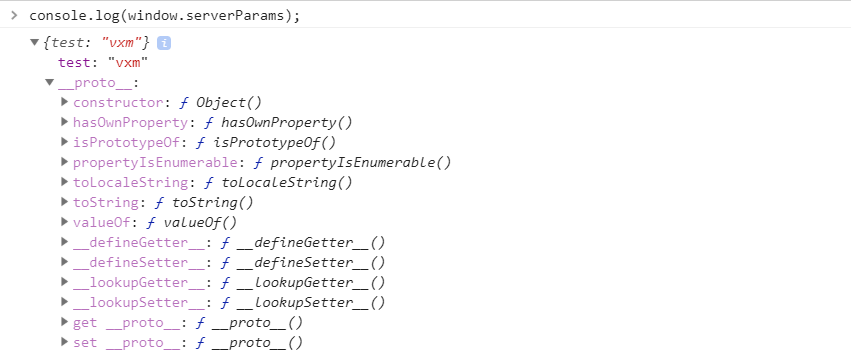

# Yii2 Js Params

[](https://packagist.org/packages/vxm/yii2-js-params)
[](https://packagist.org/packages/vxm/yii2-js-params)
[](https://travis-ci.org/vuongxuongminh/yii2-js-params)
[](https://scrutinizer-ci.com/g/vuongxuongminh/yii2-js-params/?branch=master)
[](https://scrutinizer-ci.com/g/vuongxuongminh/yii2-js-params/?branch=master)
[](http://www.yiiframework.com/)

## About it

An extension provide an easy way to passed variables from your server to the JavaScript in rendering process of Yii2 view component.

## Requirements

* [PHP >= 7.1](http://php.net)
* [yiisoft/yii2 >= 2.0.13](https://github.com/yiisoft/yii2)

## Installation

Require Yii2 JS Prams using [Composer](https://getcomposer.org):

```bash
composer require vxm/yii2-js-params
```

## Usage

You can passed any variables you want when render view with addition `jsParams` element in view params:

```php
use yii\web\Controller;

class TestController extends Controller
{

    public function actionTest()
    {
        return $this->render('test', [
            'jsParams' => [
                'test' => 'vxm'
            ]
        ]);
    }
}
```

And get this data on the frontend side from window.serverParams.

<p align="center">
    
</p>

> Note: all variables will passed at View::POS_HEAD please make sure a definition (`$this->head()`) on your layout file.

### Global params

Sometime you need to passed some params to all of view file, you can config it in your app config file:

```php
'components' => [
    'view' => [
        'params' => [
            'jsParams' => ['test' => 'vxm']
        ]
    ]
]
```

Or config an anonymous function:

```php
'components' => [
    'view' => [
        'params' => [
            'jsParams' => function() {
            
                return ['identity' => Yii::$app->user->identity->toArray()]
            }
        ]
    ]
]
```
